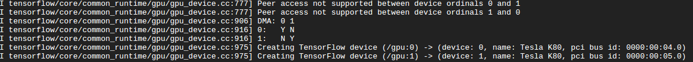

# beeva-poc-distributed-tensorflow
Proof of Concept with Tensorflow & Multi-GPUs at BEEVA Research Lab

### Experiment 2: multi-GPU

* Training on tensorflow single machine, multiple GPU
* Dataset: MNIST. 60000 train samples, 10000 test samples
* Model: Simple Convnet (5 layers) inspired by LeNet
* Based on [Transparent multi-gpu training on Tensorflow with Keras](https://medium.com/@kuza55/transparent-multi-gpu-training-on-tensorflow-with-keras-8b0016fd9012#.w0nbus9yu). Custom [fork](https://github.com/beeva-enriqueotero/keras-extras/blob/master/examples/mnist_cnn_multi.py) to implement example and fix TF 1.0 compatibility
* ***Note**: first (failed) attempt was using tf-slim. [More info](README_multigpu_tfslim.md)*
* **Infrastructure 1**: AWS p2.8x (8 gpus). Deep Learning 2.0 AMI, Keras==1.2.2, libcudnn.so.5
* **Infrastructure 2**: Google n1-standard-16 with 2 gpus (2 x nVidia Tesla K80), tensorflow-gpu==1.01, Keras==2.0.2 and 1.2.2, NVIDIA Driver 375.39, libcudnn.so.5 (CuDNN 5.1)

#### Deploy

[*Only Google*] Install NVIDIA Drivers, CuDNN, Keras and Tensorflow
```
# Execute as root
#!/bin/bash
echo "Checking for CUDA and installing."
# Check for CUDA and try to install.
if ! dpkg-query -W cuda; then
  # The 16.04 installer works with 16.10.
  curl -O http://developer.download.nvidia.com/compute/cuda/repos/ubuntu1604/x86_64/cuda-repo-ubuntu1604_8.0.61-1_amd64.deb
  dpkg -i ./cuda-repo-ubuntu1604_8.0.61-1_amd64.deb
  apt-get update
  apt-get install cuda -y
fi

# Go to https://developer.nvidia.com/rdp/cudnn-download
# Upload to Google Cloud Storage
gsutil cp -r gs://poc-tensorflow-gpus .
tar xvzf poc-tensorflow-gpus/cudnn-8.0-linux-x64-v5.1.tgz cudnn/
cd cudnn
sudo cp -P include/cudnn.h /usr/include
sudo cp -P lib64/libcudnn* /usr/lib/x86_64-linux-gnu/
sudo chmod a+r /usr/lib/x86_64-linux-gnu/libcudnn*
cd
```
[*Optional*] Modify print time format on Keras `generic_utils.py`
```
sudo nano /usr/lib/python2.7/dist-packages/Keras-1.2.2-py2.7.egg/keras/utils/generic_utils.py
```
Clone `keras-extras`
```
git clone https://github.com/beeva-enriqueotero/keras-extras
```
Launch multi-gpu experiment
```
time python keras-extras/examples/mnist_cnn_multi.py  --extras `pwd`/keras-extras/ --gpus 2
```

#### Results:

| [infrastructure](https://github.com/beeva-enriqueotero/beeva-poc-distributed-tensorflow/blob/master/README_multigpu.md#experiment-2-multi-gpu) | batch size | gpus | Accuracy (validation) | Epochs | Training time (s/epoch)
| --- | --- | --- | --- | --- | ---
| 1 | 128 | 1 | 0.9884 | 12 | 6.8
| 1 | 128 | 2 | 0.9898 | 12 | 5.2
| 1 | 128 | 3 | error | error | error
| 1 | 128 | 4 | 0.9891 | 12 | 4.9
| 1 | 128 | 8 | 0.9899 | 12 | 6.4
| 2 | 128 | 1 | 0.9892 | 12 | 7.1
| 2 | 128 | 2 | 0.9891 | 12 | 50.0+-1.0


#### Conclusions: 
* With Google 2 gpus is much slower than 1!
* With AWS p2.8x 4 gpus is the fastest configuration. Only 30% faster than 1 gpu
* With AWS 8 gpus is slightly slower than 4 
* Due to technical implementation details, only even number of gpus allowed
* CuDNN is mandatory to run the experiments
* Google Engine Documentation about [attaching GPUs to instances](https://cloud.google.com/compute/docs/gpus/add-gpus) doesn't include references to CuDNN
* Both AWS and Google GPUs use PCIe host bridge topology (PHB)

#### Issues:
* GCE attached GPU instances don't support GPUDirect peer to peer memory access
```
 labs@instance-1:/usr/local/cuda-8.0/samples/0_Simple/simpleP2P$ ./simpleP2P
    [./simpleP2P] - Starting...
    Checking for multiple GPUs...
    CUDA-capable device count: 2
    > GPU0 = "      Tesla K80" IS  capable of Peer-to-Peer (P2P)
    > GPU1 = "      Tesla K80" IS  capable of Peer-to-Peer (P2P)
    Checking GPU(s) for support of peer to peer memory access...
    > Peer access from Tesla K80 (GPU0) -> Tesla K80 (GPU1) : No
    > Peer access from Tesla K80 (GPU1) -> Tesla K80 (GPU0) : No
    Two or more GPUs with SM 2.0 or higher capability are required for ./simpleP2P.
    Peer to Peer access is not available amongst GPUs in the system, waiving test.
```

* Google GPUs use PCI instead of PCI express
```
sudo lshw -C "display" | grep capabilities
# GCE output:
# capabilities: msi bus_master cap_list
# AWS EC2 p2.8x output:
# capabilities: pm msi pciexpress bus_master cap_list
```

* Tensorflow on Google GPUs can't use DMA


